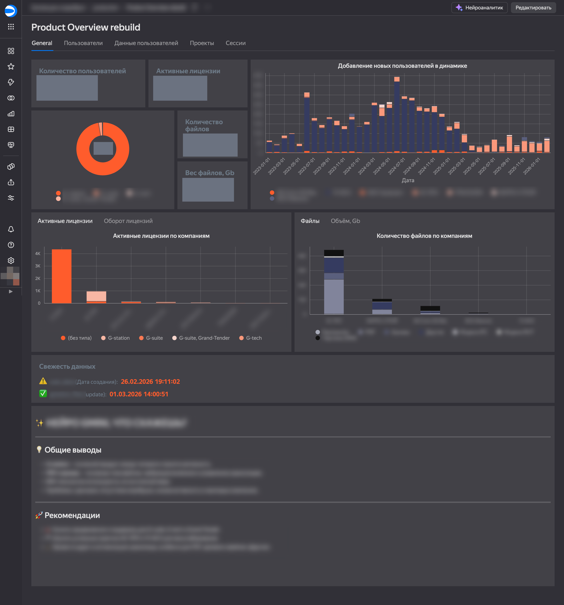
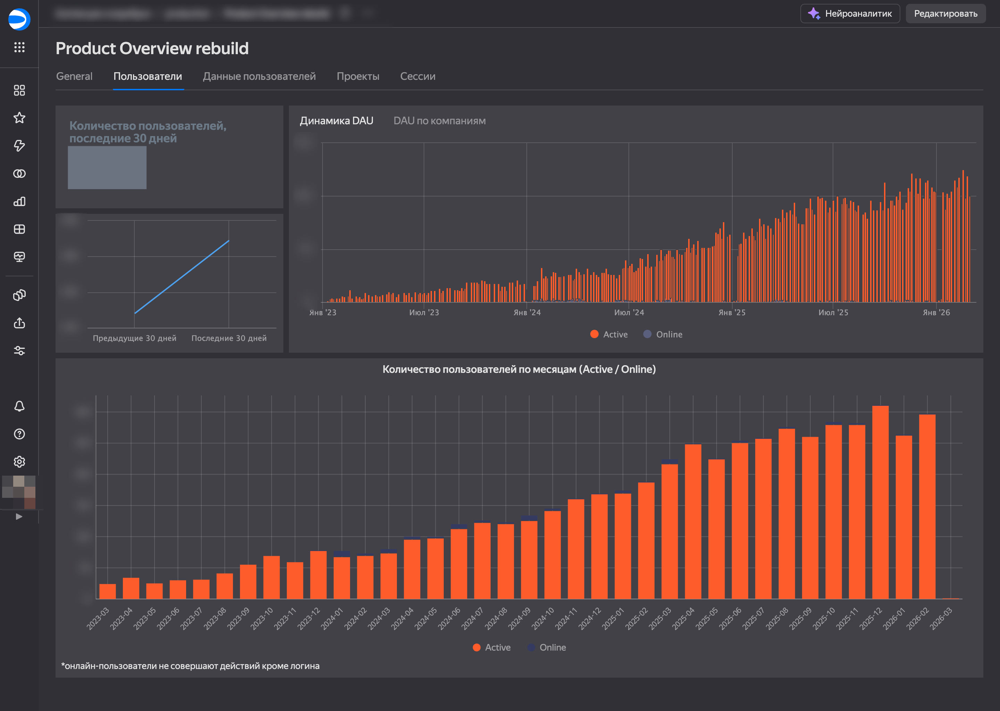
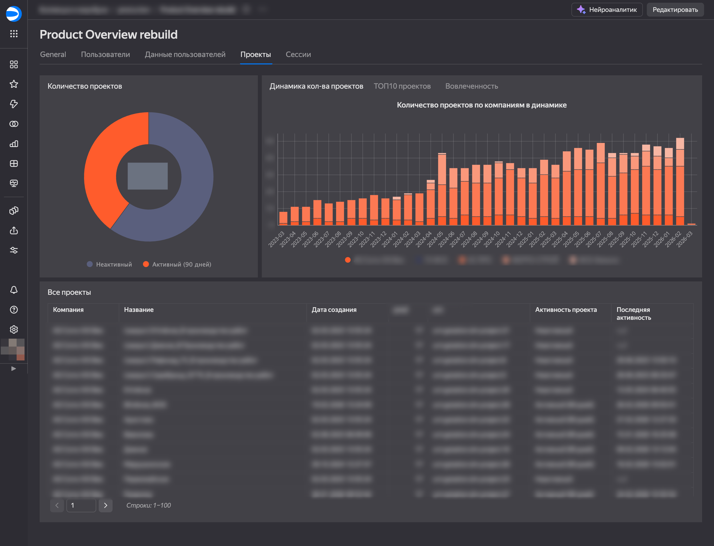
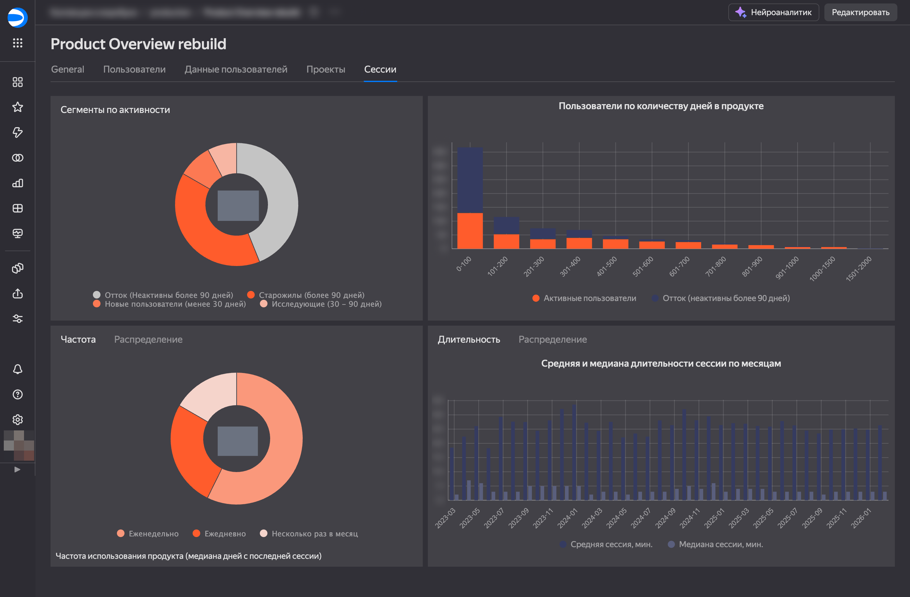
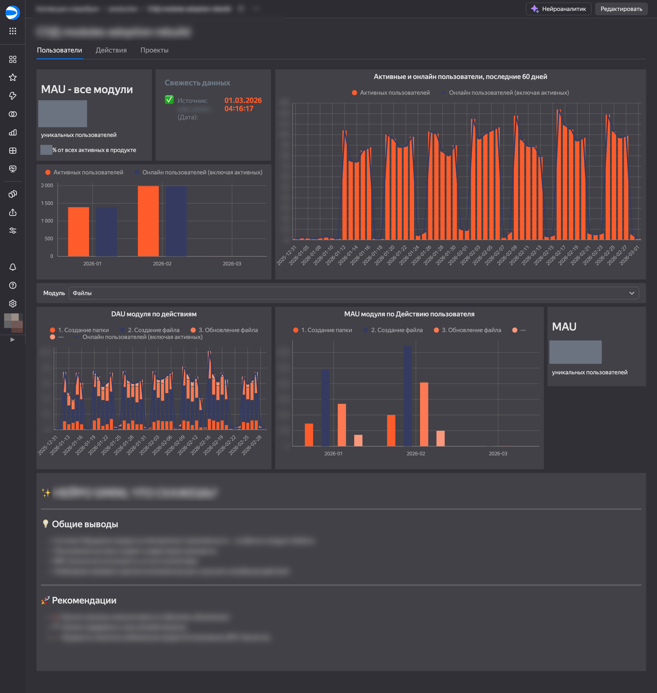
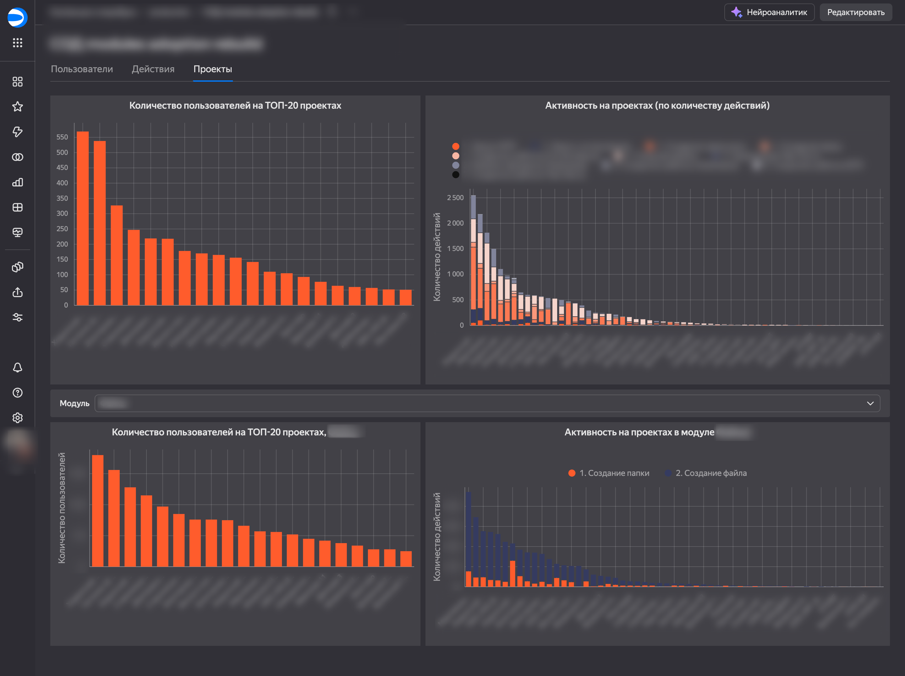
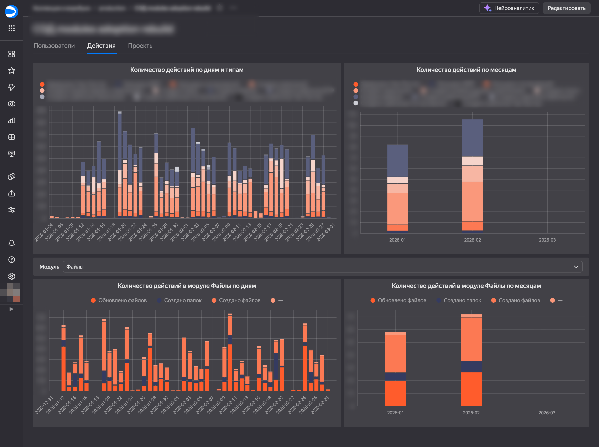

# Кейс: миграция дашбордов из Superset в DataLens

**Клиент:** сфера BIM и коллаборативных платформ для проектирования и строительства (SaaS).

**Задача:** перенести из Superset в Yandex DataLens два борда — общий обзор продукта и внедрение модулей. Данные и логику расчётов предоставил заказчик, визуал по брендбуку. Стандартные чарты DataLens не подходили, поэтому визуалы собирали в DataLens Editor: **Gravity UI**, виджеты **Markdown**, **Advanced chart** с кастомным рендером (конфиг графика, при необходимости свой HTML/JS), логика в **Prepare-скриптах на JavaScript**. Сжатые сроки — успеть к внутренней презентации заказчика. Оба борда с нуля при уже загруженных в DataLens данных сделаны за **три рабочих дня** с учётом правок.

## Борд 1: Product Overview

- KPI: число пользователей за всё время и за последние 30 дней, активные лицензии  
- Блок «Свежесть данных» по двум источникам с индикаторами давности обновления  
- Вкладки: General, Пользователи, Данные пользователей, Проекты, Сессии  

## Борд 2: Внедрение модулей (modules adoption)

- ТОП-20 проектов по пользователям, активность по действиям  
- Артефакты по дням и месяцам, MAU, активные онлайн  
- Фильтр по модулю продукта с дашборда, индикатор свежести по источнику данных  

## Дополнительно

В данных отфильтрованы support, тест и демо-компании. Скриншоты для портфолио обезличены (чувствительные значения размыты).
