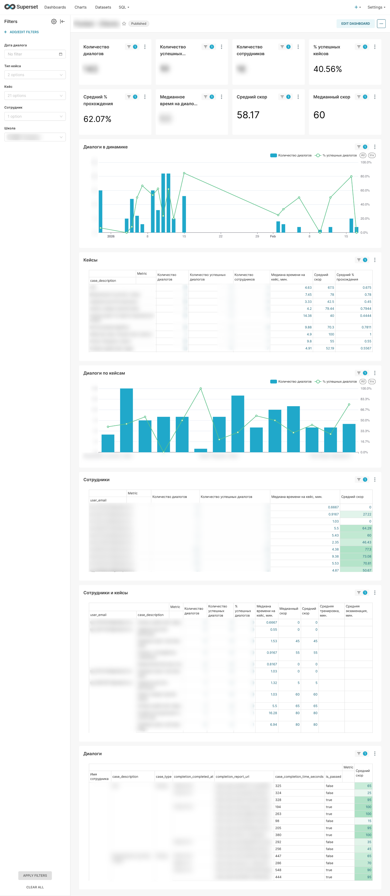

# Кейс: пайплайн данных и аналитика по обучению

**Клиент:** платформа для обучения сотрудников на кейсах с помощью ИИ (симуляции диалогов с оценкой результатов).

**Контекст:** данные о прохождении кейсов, диалогах и оценках хранились в MinIO в виде JSON. Работа с нуля: структурировать данные, спроектировать ELT-решение на Airflow и Postgres, настроить репликацию в Clickhouse, загрузить в BI и спроектировать клиентский дашборд с основными метриками, информацией о сотрудниках и кейсах.

## Что сделано

- **Пайплайн данных:** чтение JSON из MinIO → парсинг (диалоги, отчёты, пользователи, школы, кейсы, оценки) → загрузка в PostgreSQL батчами. Оркестрация через Airflow DAG (по расписанию).
- **Схема БД:** таблицы `sessions`, `messages`, `evaluation_scores`, `criteria_scores`; индексы, триггеры, представления (views) для аналитических запросов (сессии с оценками, статистика по пользователям и кейсам).
- **Парсинг оценок:** извлечение из текста отчётов итоговых баллов, баллов по критериям, вердиктов и потенциала для роста при разных форматах отчётов и сферы бизнеса у клиента (медицина, административные кейсы и т.д.).
- **Подготовка к аналитике:** план вкладки дашборда «Анализ по критериям» (рейтинг критериев, проблемные зоны, детализация), SQL-запросы и логика фильтров. Репликация в ClickHouse под аналитическую нагрузку.
- **Унификация метрик через датасеты:** единая система метрик, рассчёт метрик в BI-датасетах.
- **Реализация клиентского дашборда** по единой системе.

## Инструменты

- **Хранилище:** MinIO (исходные JSON), PostgreSQL (основное хранилище), ClickHouse (аналитика, в планах).
- **Оркестрация:** Apache Airflow (DAG’и для трансфера и применения DDL).
- **Код:** Python (парсинг JSON, клиенты MinIO/PostgreSQL, парсер отчётов), SQL (DDL, представления, аналитические запросы).
- **Окружение:** Docker на удалённом сервере, локальная разработка и тесты.
- **BI система:** Yandex DataLens (NDA), Apache Superset

## Скриншот клиентского дашборда

Скриншот обезличен (чувствительные данные размыты).

